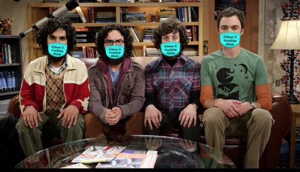

# Put a #maskon.
This application puts a mask on your face.  

Application is available at https://maskonme.herokuapp.com

# References
face-api.js: https://github.com/justadudewhohacks/face-api.js/    
spooky masks: https://github.com/jlengstorf/spooky-masks-facial-recognition  
#wearafuckingmask: https://wearafuckingmask.com  
DIYmaskchallenge: https://diymaskchallenge.org
